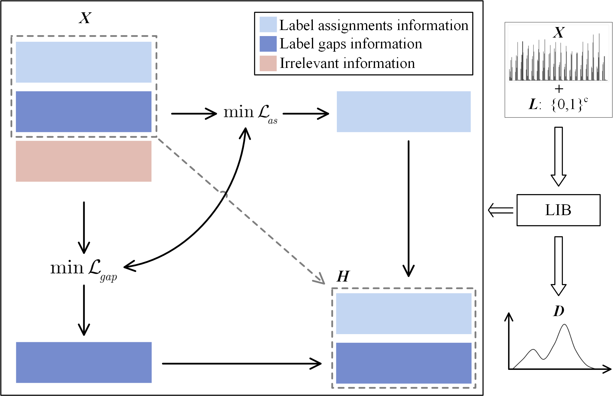

# LIBLE
Source codes of "Label Information Bottleneck for Label Enhancement, CVPR 2023"

If you find this repository useful in your research, please cite our work as follows, thanks.

@article\{LIBLE, 
      &nbsp;&nbsp;&nbsp;&nbsp;title=\{Label information bottleneck for label enhancement\}, 
      &nbsp;&nbsp;&nbsp;&nbsp;author=\{Zheng, Qinghai and Zhu, Jihua and Haoyu Tang\}, 
      &nbsp;&nbsp;&nbsp;&nbsp;booktitle=\{Proceedings of the IEEE Conference on Computer Vision and Pattern Recognition\}, 
      &nbsp;&nbsp;&nbsp;&nbsp;year=\{2023\} 
\} 

Email: zhengqinghai@fzu.edu.cn

